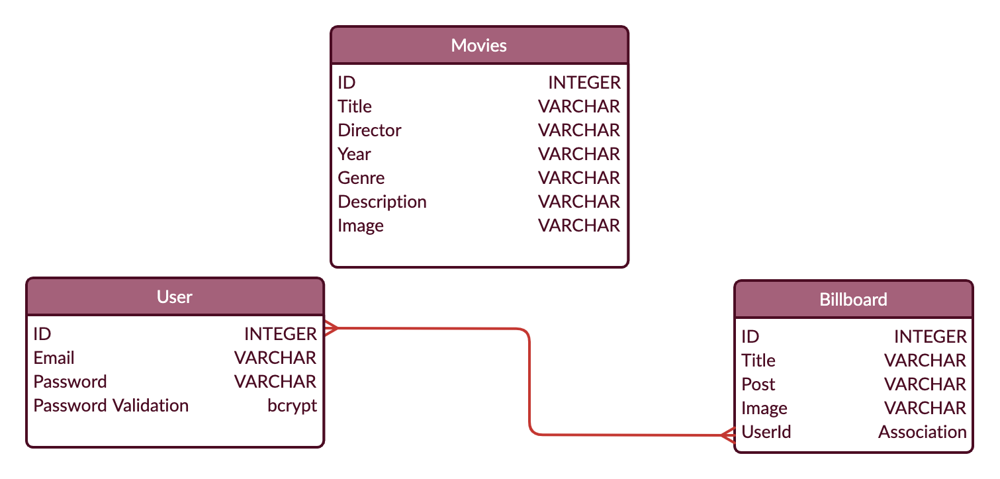
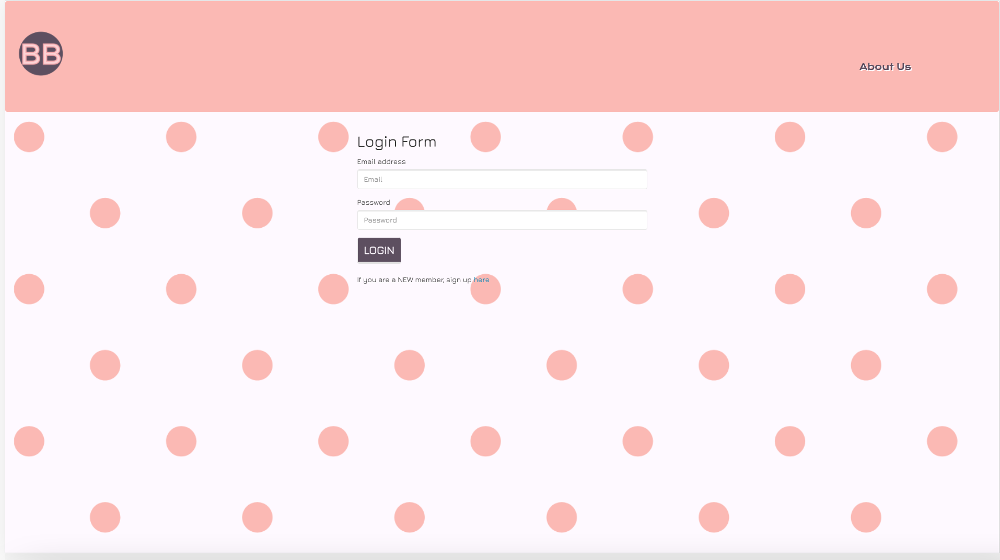
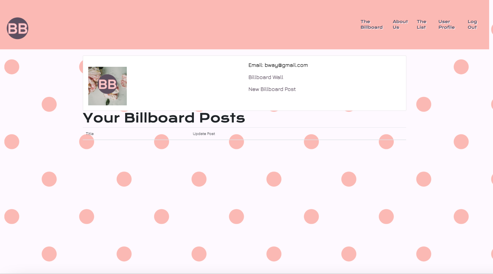
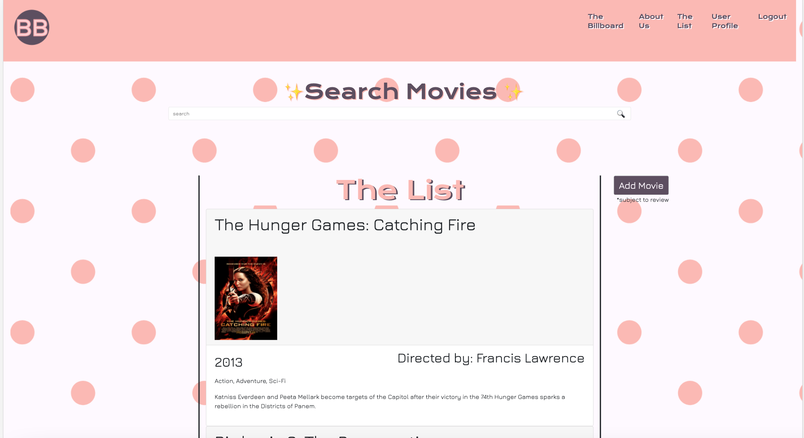
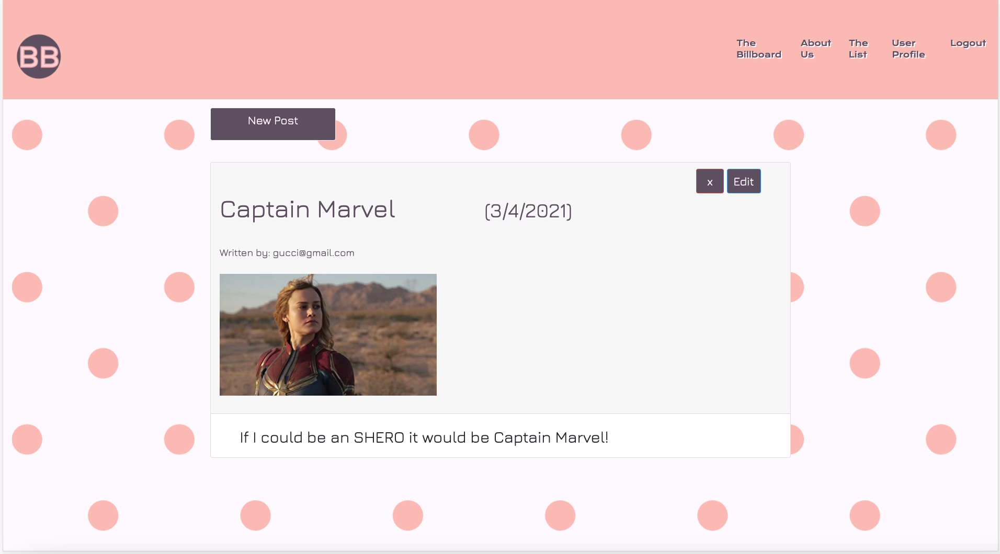
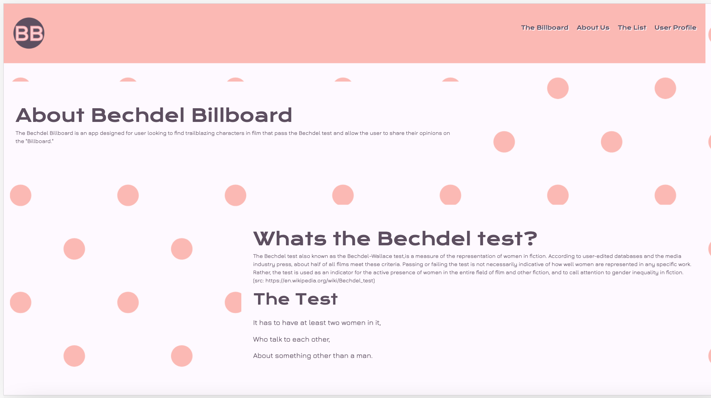

# The Bechdel Billboard

### Version 1.0

 

## License:
 

 

## Description 

The Bechdel Billboard is an app that allows the user to find a list of movies that pass the bechdel test and allow for our users to blog and comment on the stories that inspire them. The application uses MySql to store blog posts, users, and movie data. Current data is pulled from various sources on the internet and compiled into a CSV that has over 6,000 movies. The application features the ability to add movies and have them approved by the website admins before being added to the list. Future goals for the application include adding the ability to favorite movies on the list and have them stored in the database and accessed by the user on their user profile. For user security the application uses passport to encrypt passwords entered by the user. We hope our application adds an additional, interactive resource for users to learn more about movies empowering women through the decades.

 

## The Bechdel Test

In order to have a movie approved by the admins, a movie must meet this criteria:

    1. The movie has to have at least two women in it,
    2. who talk to each other,
    3. about something other than a man.

 

## Links to Application:

Deployed Application through Heroku: https://bechdelbillboard.herokuapp.com/

Github Repository: https://github.com/Franciscorosado09/BechdelBillboard

 

## Installation and Instructions

        1. Load Packages:

            npm init

        2. Run Application:

            node server.js
 

## Requirements

        1. Install Dependencies:

            npm install mysql
            npm install express
            npm install express-handlebars
            npm install express-session
            npm install mysql2
            npm install bcryptjs
            npm install body-parser
            npm install passport
            npm install passport-local
            npm install sequelize

        2. Database:

            Install latest version of MySql and MySql Workbench.

 

## Flow Charts

 

 

## Contributors :

    1. Young Ji Kim - 75% Backend, 25% Frontend
    2. Rachel Wanke - 75% Backend, 25% Frontend
    4. Francisco Rosado- Team Lead- 75% Front-end, 25% Backend

 

## Tools

Javascript, Jquery, HTML, CSS, mySQL, Heroku, Node.js, sequelize, Express, getskeleton, handlebars, passport

 

## Sreenshots of Website:

Welcome Portal:

Login Page:

User Profile:

Movie List:

Billboard/Blog:

About Us Page:

## Mock-up

Below is a rough sketch of our design process for the website, which includes where we would add additional features such as the favorites button to the application.

