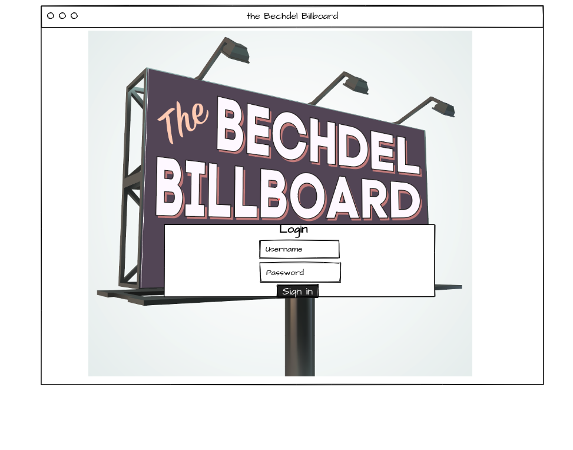
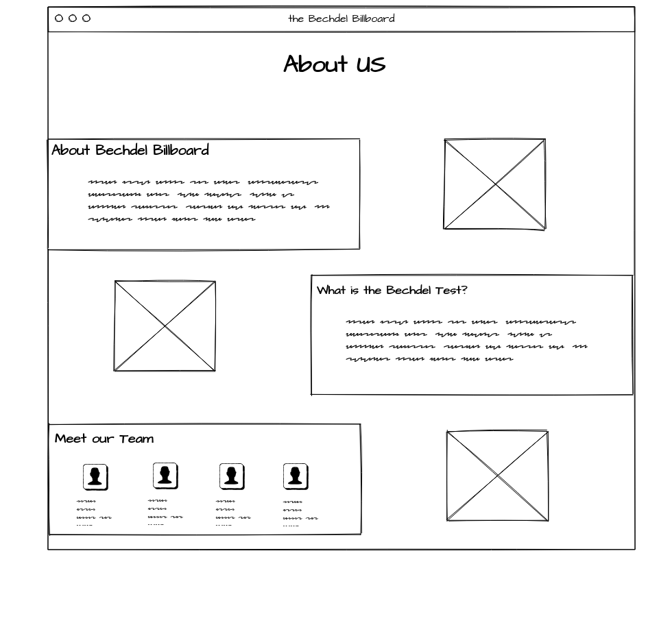
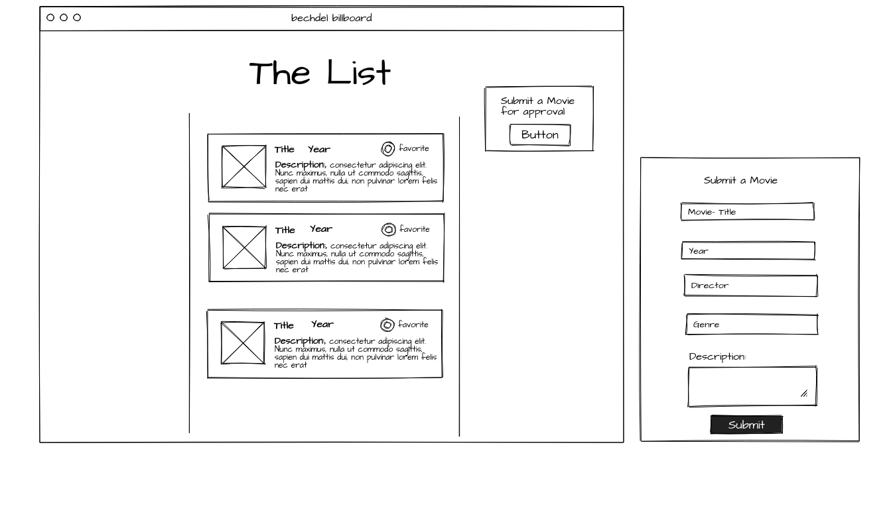
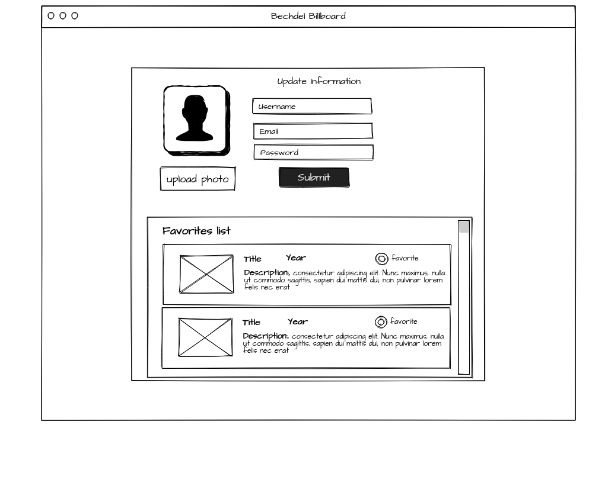
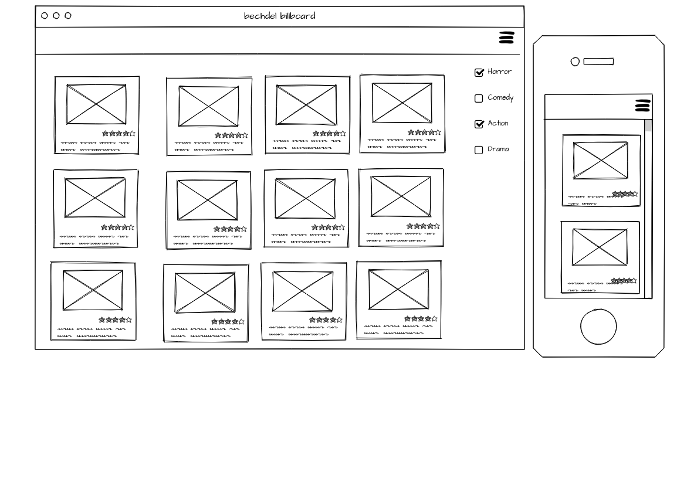
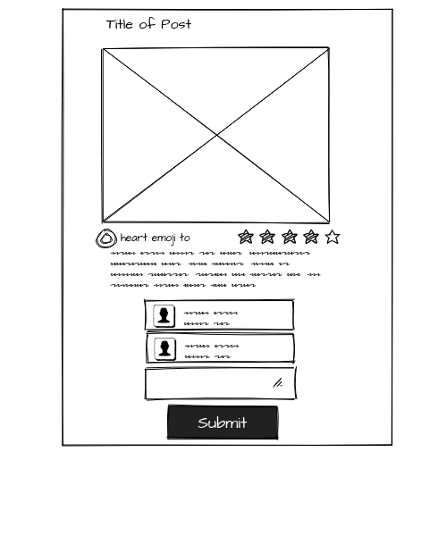

# The Bechdel Billboard

# Version 1.0

# Description 

* The Bechdel Billboard is an app that allows the user to find a list of movies that pass the bechdel test and allow for our users to blog and comment on the stories that inspire them. 

# The Bechdel Test
    1. The movie has to have at least two women in it,
    2. who talk to each other,
    3. about something other than a man.

# Mock-up

# Team Postions:

    1. Young Ji Kim - 100% Backend 
    2. Rachel Wanke - 75% Backend, 25% Frontend
    3. Terry Fife - 100% Frontend
    4. Francisco Rosado- Team Lead- 50% Linter/ 50% Front-end

# Tools

Javascript, Jquery, HTML, CSS, mySQL, Heroku, Node.js, Database, Express, 

