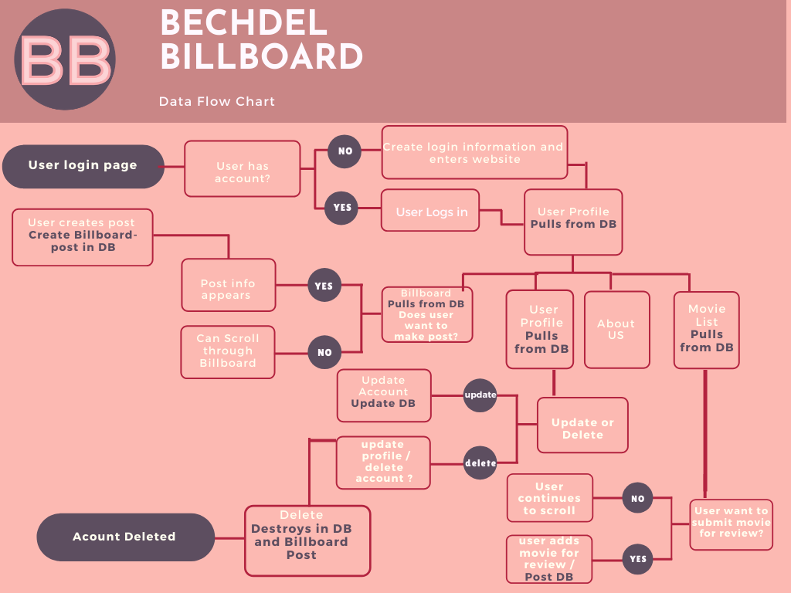

# The Bechdel Billboard

# Version 1.0

# Description 

* The Bechdel Billboard is an app that allows the user to find a list of movies that pass the bechdel test and allow for our users to blog and comment on the stories that inspire them. 

# The Bechdel Test
    1. The movie has to have at least two women in it,
    2. who talk to each other,
    3. about something other than a man.

## Installation and Instructions

        1. Load Packages:

            npm init

        2. Run Application:

            node server.js
 

## Requirements

        1. Install Dependencies:

            npm install mysql
            npm install express
            npm install express-handlebars
            npm install express-session
            npm install mysql2
            npm install bcryptjs
            npm install body-parser
            npm install passport
            npm install passport-local
            npm install sequelize

        2. Database:

            Install latest version of MySql and MySql Workbench.

 

<!-- # Mock-up

 -->

# Flow Charts

# Contributors :

    1. Young Ji Kim - 75% Backend, 25% Frontend
    2. Rachel Wanke - 75% Backend, 25% Frontend
    4. Francisco Rosado- Team Lead- 75% Front-end, 25% Backend

# Tools

Javascript, Jquery, HTML, CSS, mySQL, Heroku, Node.js, sequelize, Express, getskeleton, handlebars, passport

